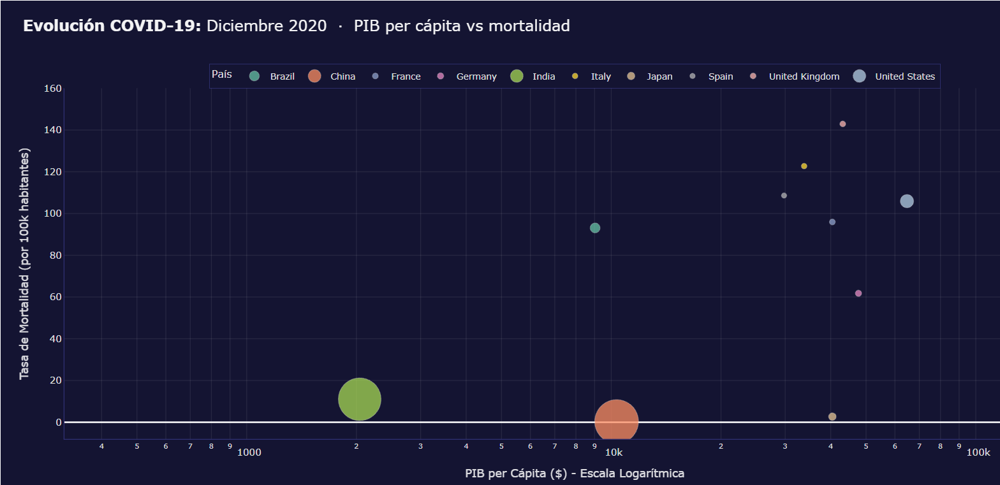

# COVID-19: Did Money Buy Survival?

**An interactive dashboard testing whether national wealth protected countries from COVID-19 mortality in 2020.**

> **Coursework project** for **Visualización (VIS)** — BSc in Data Science.
> Built as a team of three; see [Academic context](#academic-context).

[-6366f1)](#academic-context)
[](#academic-context)
[](https://www.python.org/)
[](https://shiny.posit.co/py/)
[](https://plotly.com/python/)
[](https://pandas.pydata.org/)

Six interactive visualizations built on a **189-country × 366-day panel** (69,174 observations), all aimed at a single question: **did wealth protect countries from COVID-19?**

---

## Summary

Intuition says rich countries — better hospitals, higher health spending — should have suffered less. The 2020 data says something more uncomfortable.

This project joins WHO epidemiological data with two World Bank indicators (GDP per capita and health expenditure as % of GDP) and turns them into a data-storytelling dashboard. Every chart is chosen for a stated reason rather than for decoration, following Tufte's data-ink ratio, Gestalt grouping principles, and colorblind-safe palettes.

### Findings

Spearman rank correlations on cumulative figures as of 2020-12-31 (n = 189 countries):

| Relationship | ρ | Reading |
|---|---|---|
| GDP per capita ↔ Incidence / 100k | **+0.60** | Rich countries **recorded far more cases** |
| GDP per capita ↔ Mortality / 100k | **+0.49** | And **more deaths** per capita, not fewer |
| GDP per capita ↔ Case fatality rate | **−0.10** | Once infected, wealth barely mattered |
| Health spending (% GDP) ↔ CFR | **+0.10** | Spending more did **not** lower lethality |

**The takeaway:** in 2020, money did not buy protection. The five countries with the highest deaths per 100k (San Marino, Belgium, the United Kingdom, Slovenia, Italy) are all developed economies. The strong positive correlation between wealth and incidence (+0.60) is largely a **detection effect**: richer countries tested more, so they counted more cases. That bias is exactly why the case fatality rate — which only counts deaths *among confirmed cases* — is the panel's most honest metric, and there the correlation with wealth vanishes (−0.10).

> **Methodological caveat:** these are ecological, country-level correlations, not causal estimates. They are confounded by age structure (wealthy countries are older, and age is the strongest predictor of COVID mortality), death-registration practices, and testing capacity. The dashboard is built to **generate hypotheses, not to settle them**.



*December 2020. Wealthy countries (right) cluster at the top of the mortality axis; India and China (left, large bubbles) sit near zero.*

---

## The six visualizations

Each chart attacks the question from a different angle, and each has a stated rationale:

| # | Visualization | Question it answers | Why this chart |
|---|---|---|---|
| 01 | **Motion Chart** (animated bubbles) | Did rich countries flatten the curve sooner? | Restores the temporal narrative a static chart loses. GDP (log) × mortality, size = population, color = country, animation = month |
| 02 | **Ridgeline Plot** ("The Waves") | When did each wave hit each country? | Gestalt proximity: stacking distributions instead of overlaying lines avoids the chart junk of ten tangled series |
| 03 | **Dumbbell Chart** | How much did incidence grow from January to December? | Maximizes data-ink ratio: one thin line between two points instead of two bars. The line's length **is** the magnitude |
| 04 | **Calendar Heatmap** | Are there cyclical patterns or reporting artifacts? | Surfaces temporal hotspots and administrative artifacts (e.g. weekends systematically lighter due to missing reporting) |
| 05 | **Health Efficiency Matrix** | Did health spending prevent deaths? | A 4-dimensional chart (x, y, color, size) whose quadrants act as manual clustering: "Efficient", "Overwhelmed", "Resilient" |
| 06 | **Choropleth Map** | Where were the global hotspots? | Color saturation across full territories makes regional patterns immediately legible |

Full variable definitions and theoretical grounding: [`docs/technical_specifications.md`](docs/technical_specifications.md).

---

## Quick start

Requires **Python 3.12+**. The dataset ships with the repository, so there is no download step.

```bash
git clone https://github.com/cofrian/covid19-wealth-mortality.git
cd covid19-wealth-mortality
```

**With [uv](https://docs.astral.sh/uv/) (recommended):**

```bash
uv run shiny run app.py
```

**With pip:**

```bash
python -m venv .venv
source .venv/bin/activate        # Windows: .venv\Scripts\activate
pip install -r requirements.txt
shiny run app.py
```

Open <http://127.0.0.1:8000>. The first load takes a few seconds: it reads 69k rows and precomputes the animation frames.

> **Note on Plotly:** the dependencies pin `plotly==5.24.1` deliberately. On the 6.x line, the `FigureWidget` objects that `shinywidgets` creates never initialize in the browser and **all six charts render blank with no server-side error**. Do not bump Plotly without confirming the charts still draw.

> **Note on the Motion Chart:** it is rendered as embedded Plotly HTML inside an iframe rather than through `@render_widget`. `FigureWidget` does not support animation frames, so serving it as a widget silently drops them — the Play button and slider appear, but the bubbles never move.

---

## The data

`panel_2020_paises_sin_nan_R_clean.csv` — 10 MB, 69,174 rows, a complete country-day panel from 2020-01-01 to 2020-12-31 covering 189 countries. It is committed to the repository on purpose: it sits far below GitHub's file-size limit and keeps the project clone-and-run.

**Sources:** epidemiological data from the **WHO**; GDP per capita (2019) and health expenditure (% of GDP) from the **World Bank**. Panel cleaning and consolidation were done in R (hence the `_R_clean` suffix), including dropping incomplete records and filling the economic indicators, which are constant per country.

**Schema (16 columns):**

| Column | Type | Description |
|---|---|---|
| `iso3c` | str | ISO 3166 alpha-3 code, used for map projections |
| `pais` | str | Country name |
| `fecha` | date | Record date (YYYY-MM-DD) |
| `poblacion` | int | Total inhabitants |
| `confirmados` / `muertes` | int | **Cumulative** cases and deaths |
| `confirmados_dia` / `muertes_dia` | int | **Daily** new cases and deaths |
| `IA_100k` | float | Cumulative incidence: (cases / population) × 100,000 |
| `tasa_mortalidad_100k` | float | (deaths / population) × 100,000 |
| `letalidad_CFR_pct` | float | Case fatality rate: (deaths / cases) × 100 |
| `IA_100k_dia`, `tasa_mortalidad_100k_dia`, `letalidad_CFR_pct_dia` | float | Daily counterparts of the three metrics above |
| `pib_per_capita_2019` | float | GDP per capita in USD (World Bank, 2019) |
| `gasto_salud_pib` | float | Health expenditure as % of GDP |

The six derived metrics are the analytical core: they normalize by population and make countries of wildly different scales comparable. Without them, every chart collapses into a ranking of large countries.

---

## Design decisions

The project follows its own visual identity guide ([`docs/colors.md`](docs/colors.md)) with explicit rules:

- **Accessibility:** colorblind-safe categorical palette (Set2) and the **Viridis** sequential scale — perceptually uniform and legible in grayscale.
- **No red-green pairing:** never used as opposites. Red is reserved **exclusively** for critical mortality alerts.
- **Visual fatigue:** `#FDFDFD` instead of pure white, `#455A64` text instead of pure black, and a barely-there `#E5E5E5` grid.

---

## Project structure

```
.
├── app.py                                  # Full Shiny app: UI, CSS, and the six charts
├── panel_2020_paises_sin_nan_R_clean.csv   # Country-day panel, 2020 (189 countries × 366 days)
├── docs/
│   ├── technical_specifications.md         # Variables and rationale for each chart
│   ├── colors.md                           # Visual identity and accessibility guide
│   └── preview.png                         # Motion Chart preview (December 2020)
├── pyproject.toml                          # Project metadata and dependencies
├── requirements.txt                        # Pinned dependencies (pip alternative)
└── uv.lock                                 # Reproducible environment resolution
```

---

## Stack

**Shiny for Python** (server-side reactivity) · **Plotly** via `shinywidgets` (interactive charts) · **pandas** / **numpy** (panel transformation) · **uv** (dependency management) · custom CSS for the dark theme and scroll navigation.

---

## Academic context

This is a **coursework project for Visualización (VIS)**, a course in the **BSc in Data Science**. The assignment was to take a real multivariate dataset and build an interactive dashboard where every visualization is justified by visualization theory rather than chosen for looks — which is why each chart in the table above comes with an explicit rationale (data-ink ratio, Gestalt principles, DIKW hierarchy, colorblind-safe encoding) and why [`docs/technical_specifications.md`](docs/technical_specifications.md) and [`docs/colors.md`](docs/colors.md) exist as design documents rather than afterthoughts.

Built as a team of three:

- **Fernando Martínez Gómez** — [@fmargom](https://github.com/fmargom)
- **Luis Trigueros Espada** — [@luistrge](https://github.com/luistrge)
- **Sergio Ortiz** — [@cofrian](https://github.com/cofrian)

The dashboard interface is in Spanish; this documentation is in English.
